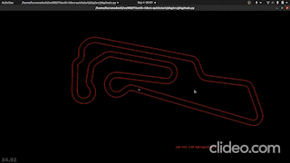
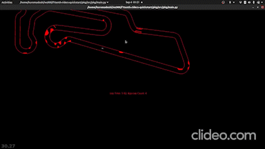

# The F1TENTH Grand Prix - Team AGV

This is a project submission of Team AGV for the 10th F1TENTH Autonomous Grand Prix, ICRA 2022

## Requirements

* Python 3.8
* Pip 22.0.3

There can be issues with installation when using older pip versions. 

## Developing your Driver

To develop your driver you can work in the folder [pkg/src/pkg](./pkg/src/pkg).

### Structure of a Driver

most basic Driver looks as follows, which is in the file [drivers.py](./pkg/src/pkg/drivers.py)

```python
class SimpleDriver:    

    def process_observation(self, ranges=None, ego_odom=None):
        speed = 5.0
        steering_angle = 0.0
        return speed, steering_angle
```

A Driver is just a class that has a ```process_observation``` function which takes in  and odometry data and returns a speed to drive at along with a steering angle.

```ranges```: an array of 1080 distances (ranges) detected by the LiDAR scanner. As the LiDAR scanner takes readings for the full 360&deg;, the angle between each range is 2&pi;/1080 (in radians).

``ego_odom``: A dict with following indices:

```
{
  'pose_x': float,
  'pose_y': float,
  'pose_theta': float,
  'linear_vel_x': float,
  'linear_vel_y': float,
  'angular_vel_z': float,
}
```

```steering_angle```: an angle in the range [-&pi;/2, &pi;/2], i.e. [-90&deg;, 90&deg;] in radians, with 0&deg; meaning straight ahead.

### Choosing a Driver

Let's look at the [main.py](./pkg/src/pkg/main.py) file. The section shown below is all we need to worry about.

```python
...
# import your drivers here
from pkg.drivers import DisparityExtender

# choose your drivers here (1-4)
drivers = [DisparityExtender()]

# choose your racetrack here (Oschersleben, SOCHI, SOCHI_OBS)
RACETRACK = 'Oschersleben'
...
```

As shown in the comments above, we can import Drivers and then choose which ones we want to use. Let's import our SimpleDriver and choose it

```python
...
# import your drivers here
from pkg.drivers import DisparityExtender, SimpleDriver

# choose your drivers here (1-4)
drivers = [SimpleDriver()]
...
```

Now if you run the main.py file again, it uses our SimpleDriver

```bash
$ python main.py
```
### Multi-Agent Racing

To practice racing multiple Drivers against each other, simply choose multiple Drivers! You may choose up to 4 drivers, but in practice the simulator will usually run very slowly if you choose more than 2. You may race the same Driver against itself by choosing it twice. If you try racing GapFollower against itself, you will find that it is not good at multi-agent racing! 

Here's how we would race GapFollower against SimpleDriver:

```python
# import your drivers here
from pkg.drivers import GapFollower, SimpleDriver

# choose your drivers here (1-4)
drivers = [GapFollower(), SimpleDriver()]

# choose your racetrack here (Oschersleben, SOCHI, SOCHI_OBS)
RACETRACK = 'Oschersleben'
```

### Changing Map

You may choose between the ordinary Sochi map or the Sochi Obstacles map. These are the sample maps that you can use in your tests. Competition will take place in Oschersleben map. The one with obstacles is hidden from participants. To switch maps, simply change the name of the selected `RACETRACK`

```python
...
# choose your racetrack here (Oschersleben, SOCHI, SOCHI_OBS)
RACETRACK = 'Oschersleben'
...
```

### The Solution

Our solution for this competition is reactive planner called DisparityExtender which is integrated with MPC following an optimal racing line, this planner can travel fast in obstacle free regions but can also static obstacles easily. Here is a refrence documentation for the [Disparity Extender Algorithm](https://www.nathanotterness.com/2019/04/the-disparity-extender-algorithm-and.html)

## Results

<p float="left">
  
  
</p>

## Preparing a Submission

Prerequisites installs for submitting are: [Docker](https://www.docker.com/products/docker-desktop), [jq](https://stedolan.github.io/jq/)

Use the file [pkg/nodes/f1tenth_ros_agent.py](pkg/nodes/f1tenth_ros_agent.py) to choose the driver you are submitting, as shown below, where we choose the DisparityExtender driver:

```python
...
from pkg.drivers import DisparityExtender as Driver
...
```

If you're using additional dependencies, make sure they are provided in the `pkg/requirements.txt` file (or update your Docker image accordingly, if you know Dockerfile format).

Create an `.env` file at the root of the project with following contents:

```bash
RACE_MAP_PATH=/catkin_ws/src/f1tenth_gym_ros/maps/Oschersleben.yaml
RACE_MAP_IMG_EXT=.png
F1TENTH_AGENT_NAME=a1
F1TENTH_AGENT_IMAGE=a1
RIDERS_CHALLENGE_ID=67
RIDERS_API_HOST=https://api.riders.ai
```

**NOTE:** If you're on Linux, change `ROS_MASTER_URI=http://host.docker.internal:11311` lines in `docker-compose.yml` with `ROS_MASTER_URI=http://172.17.0.1:11311`. Otherwise your separate Docker instances won't be able to find each other.

Then, from the root of the project, build your submission:

```bash
docker-compose build agent
```

## Testing a Submission

The submission platform uses ROS to run the cars. Your car should race almost exactly the same in ROS as it did in the environment used in `Developing your Driver`, but it is a good idea to double-check sometimes by using ROS locally. This section will show you how to test your submission (if you want to) before you upload it.

Note: choose between `SOCHI.yaml` and `SOCHI_OBS.yaml` (or `Oschersleben.yaml`) in the `.env` file shown above to choose which map to test on (this will not have an effect on what map is used when you submit)

Start ROSCore & F1Tenth ROS Bridge:

```bash
docker-compose up --force-recreate roscore-dev bridge-dev
```

Go to http://localhost:6080 , if everything worked properly until now, you should see simulator window. 

Finally, from another terminal, launch the Driver agent:   

```bash
docker-compose up --force-recreate agent-dev
``` 

You should see your agent start driving along the track.
